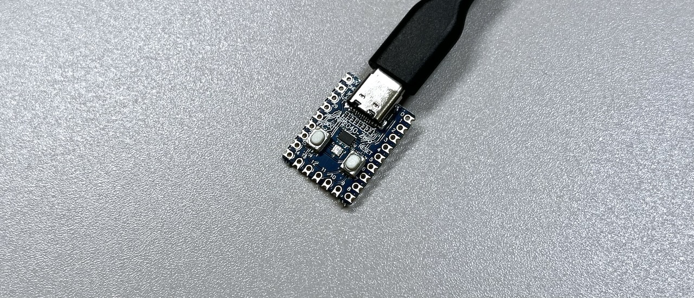

# Undertow / Undertow Alterna ビルドガイド

## キット内容
 
||部品名|数|
|-|-|-|
|1|メインボード|1|
|2|ボトムプレート|1|
|3|支柱|8|
|4|M2なべねじ|16|
|5|M2ワッシャー|32|
|6|M2スプリングワッシャー|16|
|7|M2ナット|16|
|8|M2スペーサー|12|
|9|M3角ナット|8|
|10|M3なべねじ|8|
|11|14pピンソケット|2|
|12|40pピンヘッダー|2|
|13|ジャンパーピン|8|
|14|MOSFET|1|
|15|10kΩ抵抗|2|
|16|RP2040-Zero|1|

### キット以外に必要なもの
 
|部品名|数|
|-|-|
|Killer Whale 側面ユニット|2|
|Type-C USBケーブル|1|

## 組み立て
Undertow / Undertow Alternaには裏表と前後がありお好みの形状で組み立てることができます。 
 
ビルドガイドではUndertowを使いこのように組み立てます。  
 

### （オプション）LEDを発光させる場合
MOSFETと10kΩ抵抗をはんだ付けします。  
 

### 支柱の組み立て
M2なべねじ（銀）12本にM2ワッシャー（銀）を通します。  
 

支柱の保護フィルムをはがし、スペーサーをなべねじで止めます。  
 

M3角ナットをスリットに立てます。
 

支柱で挟み込み、M2ワッシャー、M2スプリングワッシャー、M2ナットの順に通して固定します。  
 

すべての支柱を組み立てます。
 

### 側面ユニットへの支柱の取り付け
シルク印刷を見て側面ユニットの取り付け方を確認します。側面ユニットは傾斜に合わせて左右を組み立ててください。  
 

スイッチプレートを外した側面ユニットに支柱を差し込み、M3なべねじで止めます。  
 

側面ユニットの傾きに合わせてスイッチプレートや保護プレートを取り付けます。 
 

### ピンソケットのはんだ付け
14pピンソケット2本から6pを4本切り出します。  
 

側面ユニットのピンヘッダーに差し込み、側面ユニットの支柱をメインボードに差し込みM3なべねじで止めます。はんだ付けが終わったら外すのできつく締めないでください。  
 

ピンソケットをメインボードにはんだ付けします。  
 

### RP2040-Zeroへのテストファームウェアの書き込み
こちらのuf2ファイルをダウンロードしてください。  
- !URL!

BOOTボタンを押しながらUSBケーブルでPCと接続するとRPI-RP2というドライブとして認識されるのでダウンロードしたuf2ファイルをドラッグアンドドロップするとキーボードとして認識されるようになります。  
 

### RP2040-Zeroのはんだ付け
RP2040-Zeroをピンソケットをはんだ付けしたのと同じ面に取り付けます。  
RP2040-Zeroに付属しているピンヘッダをメインボードに差し込み、RP2040-Zeroを乗せます。  
> [!IMPORTANT] 
> 組み立て方で裏表が異なります。シルク印刷の5V、0、7、15ピンの位置を合わせてください。
> 

 

ピンヘッダの足を切りRP2040-Zeroにはんだ付けします。  
  

裏返してRP2040-Zeroをメインボードに固定します。  
  

### ピンヘッダーのはんだ付け
ピンヘッダーをピンソケットをはんだ付けしたのと同じ面に取り付けます。  
40pピンヘッダー2本から4pを16個切り出します。  
  

枠内にはんだ付けします。  
> [!NOTE] 
> 面倒なら使う予定のユニット分だけでも大丈夫です。
  

使用する側面ユニットの種類にジャンパーピンを4つずつ差し込みます。  
  

### ボトムプレートの取り付け
ボトムプレートをメインボードに当てて、ボトムプレート側からM2なべネジ（黒）を差し込みます。  
   

反対側にワッシャー、スプリングワッシャー、ナットを取り付けます。  
  

### 側面ユニットの取り付け
側面ユニットのピンヘッダーをピンソケットに差し込みながら支柱をメインボードに差し込み、M3なべねじで固定します。  
  

ゴム足をボトムプレートに取り付けたら完成です。  
  

USBケーブルを差し込んで側面ユニットの反応を確かめてください。

## キーのカスタマイズ
### ファームウェアの更新

こちらのuf2ファイルをダウンロードしてください。
-  !URL!

テストファームウェアで02が入力されるキーを調べてから一度USBケーブルを外し、そのキーを押しながらPCに接続してしばらく待つとRPI-RP2ドライブが出てきます。  
  
うまくいかない場合はテストファームウェアを書き込んだ時と同様にRP2040-ZeroのBOOTボタンを押しながらUSBケーブルを差しこんでください。  

RPI-RP2ドライブにダウンロードしたuf2ファイルをドラッグアンドドロップしたらファームウェアの更新完了です。  

### Remapへの接続
Google Chrome（もしくはChromiumベースのブラウザ）でRemapにアクセスしてください。
- !URL!

青いボタンを押してUndertowを選ぶと接続できます。
   

### 保存と復元

### 形の変更
裏表、前後、Alternaとの切り替えはこちらから行えます。

### キーの割り当て
下の一覧からを上のキーにドラッグアンドドロップするとキー設定を変更することができます。

### 特殊なキーの割り当て
FUNCTIONSタブのVIA USER KEYにOSに関わらず使えるショートカットやトラックボール、OLEDなどの設定をするキーがあります。

### LEDの調整

