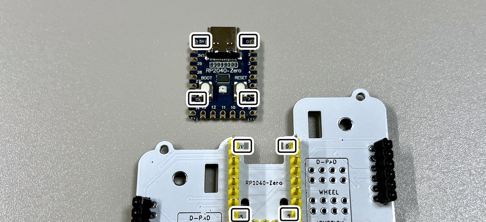
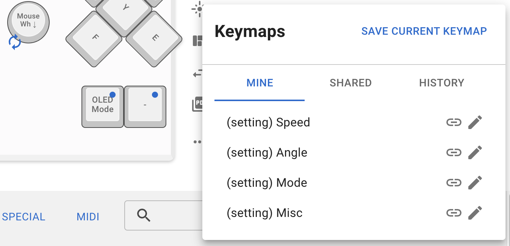

# Undertow / Undertow Alterna ビルドガイド

## キット内容

||部品名|数|
|-|-|-|
|1|メインボード|1|
|2|ボトムプレート|1|
|3|支柱|8|
|4|M2なべねじ|16|
|5|M2ワッシャー|32|
|6|M2スプリングワッシャー|16|
|7|M2ナット|16|
|8|M2スペーサー|12|
|9|M3角ナット|8|
|10|M3なべねじ|8|
|11|14pピンソケット|2|
|12|40pピンヘッダー|2|
|13|ジャンパーピン|8|
|14|MOSFET|1|
|15|10kΩ抵抗|2|
|16|ゴム足|4|
|17|RP2040-Zero|1|

### キット以外に必要なもの

|部品名|数|
|-|-|
|Killer Whale 側面ユニット|2|
|Type-C USBケーブル|1|
> [!WARNING]
>ジョイスティック側面ユニット2個の組み合わせとホイール側面ユニット2個の組み合わせには対応していません。

## 組み立て
Undertow / Undertow Alternaには裏表と前後がありお好みの形状で組み立てることができます。

ビルドガイドでは2つのユニットが同じ向きのUndertowでこのように組み立てます。

### （オプション）LEDを発光させる場合
MOSFETと10kΩ抵抗をはんだ付けします。

### 支柱の組み立て
M2なべねじ（銀）12本にM2ワッシャー（銀）を通します。

支柱の保護フィルムをはがし、スペーサーをなべねじで止めます。

M3角ナットをスリットに立てます。

支柱で挟み込み、M2ワッシャー、M2スプリングワッシャー、M2ナットの順に通して固定します。

すべての支柱を組み立てます。

### 側面ユニットへの支柱の取り付け
シルク印刷を見て側面ユニットの取り付け方を確認します。側面ユニットは傾斜に合わせて左右を組み立ててください。

スイッチプレートを外した側面ユニットに支柱を差し込み、M3なべねじで止めます。

側面ユニットの傾きに合わせてスイッチプレートや保護プレートを取り付けます。

### ピンソケットのはんだ付け
14pピンソケット2本から6pを4本切り出します。

側面ユニットのピンヘッダーに差し込み、側面ユニットの支柱をメインボードに差し込みM3なべねじで止めます。はんだ付けが終わったら外すのできつく締めないようにします。

ピンソケットをメインボードにはんだ付けします。

### RP2040-Zeroへのテストファームウェアの書き込み
<<<<<<< Updated upstream
こちらのuf2ファイルをダウンロードしてください。
- [tarohayashi_undertow_default.uf2](https://github.com/Taro-Hayashi/Undertow/releases/latest/download/tarohayashi_undertow_default.uf2)
=======
こちらのuf2ファイルをダウンロードしてください。
- [tarohayashi_undertow_default.uf2](https://github.com/Taro-Hayashi/Undertow/releases/latest/download/tarohayashi_undertow_default.uf2)
>>>>>>> Stashed changes

BOOTボタンを押しながらUSBケーブルでPCと接続するとRPI-RP2というドライブとして認識されるので、ダウンロードしたuf2ファイルをドラッグアンドドロップするとキーボードとして認識されるようになります。

### RP2040-Zeroのはんだ付け
ねじを外して側面ユニットを取り外します。

RP2040-Zeroをピンソケットをはんだ付けしたのと同じ面に取り付けます。

> [!CAUTION]
> 組み立て方でRP2040-Zeroの裏表が異なります。シルク印刷の5V、0、7、15ピンの位置を合わせてください。

ピンヘッダの足を切り両面をはんだ付けします。

### ピンヘッダーのはんだ付け
ピンヘッダーをピンソケットをはんだ付けしたのと同じ面に取り付けます。

> [!NOTE]
> 使う予定のユニット分だけでも大丈夫です。

使用する側面ユニットの種類にジャンパーピンを4つずつ差し込みます。

### ボトムプレートの取り付け
M2なべねじ4本にワッシャーを通します。

ボトムプレートをメインボードに当てて、ボトムプレート側からM2なべねじを差し込み、M2ワッシャーとM2ワッシャー、M2ナットで固定します。

### 側面ユニットの取り付け
側面ユニットのピンヘッダーをピンソケットに差し込みながら支柱をメインボードに差し込み、M3なべねじで固定します。

ゴム足をボトムプレートに取り付けたら完成です。

USBケーブルを差し込んで側面ユニットの反応を確かめましょう。

## キーのカスタマイズ
### ファームウェアの更新

こちらのuf2ファイルをダウンロードしてください。
-  [tarohayashi_undertow_via.uf2](https://github.com/Taro-Hayashi/Undertow/releases/latest/download/tarohayashi_undertow_via.uf2)

基盤にBOOTと書かれている側の2キーを押しながらUSBケーブルを接続するとRPI-RP2ドライブとして認識されます。

> [!NOTE]
> うまくいかない場合はテストファームウェアを書き込んだ時と同様にRP2040-ZeroのBOOTボタンを押しながらUSBケーブルを差しこむか、BOOTボタンを押しながらRESETボタンを押したあと少し待ってBOOTボタンから指を離してください。

RPI-RP2ドライブにダウンロードしたuf2ファイルをドラッグアンドドロップしたらファームウェアの更新完了です。
Remapでキーを変更できるようになりました。
- https://remap-keys.app

### トラックボールやジョイスティックの設定
標準では各キースイッチを長押しすることで設定用のレイヤーに移行するようになっています。
|レイヤー番号|機能|
|-|-|
|4|SIDE1の速度変更|
|5|SIDE0の速度変更|
|6|SIDE1の角度変更|
|7|SIDE0の角度変更|
|8|SIDE1の軸反転、入力モード変更|
|9|SIDE0の軸反転、入力モード変更|

> [!TIP]
> SIDE1、SIDE0は組み立てる方向や裏表によって変わります。
> ジョイスティックが違うSIDEで認識されている場合は一度スティックを押し込んでください。

また、Remapの共有キーマップに各種設定キーを配置したキーマップがあります。

RemapにはFUNCTIONSタブのVIA USER KEYにトラックボールやジョイスティックの設定ができるキーがあります。

|Reamp|キーコード||
|-|-|-|
|Speed + SIDE0|SPD_I_0|SIDE0側の速度、感度を上げる|
|Speed - SIDE0|SPD_D_0|SIDE0側の速度、感度を下げる|
|Angle + SIDE0|ANG_I_0|SIDE0側の角度を増やす|
|Angle - SIDE0|ANG_D_0|SIDE0側の角度を減らす|
|Invert X SIDE0|INV_0|SIDE0側の軸を片方反転させる|
|Mode Change SIDE0|CHMOD_0|SIDE0側の入力モードを変える|
|Speed + SIDE1|SPD_I_1|SIDE1側の速度、感度を上げる|
|Speed - SIDE1|SPD_D_1|SIDE1側の速度、感度を下げる|
|Angle + SIDE1|ANG_I_1|SIDE1側の角度を増やす|
|Angle - SIDE1|ANG_D_1|SIDE1側の角度を減らす|
|Invert X SIDE1|INV_1|SIDE1側の軸を片方反転させる|
|Mode Change SIDE1|CHMOD_1|右手側の入力モードを変える|
|Invert Scroll|INV_SCRL|スクロール方向を反転する|
|Toggle Auto Mouse|AUTO_MOUSE|オートマウス機能の切り替え|
|OLED Mode|OLED_MOD|OLEDの機能の切り替え|
|D-Pad Mode|DPAD_MO|斜め入力除外機能の切り替え|
|Cursor Mode|MOD_CUR|押している間だけカーソル移動|
|Scroll Mode|MOD_SCRL|押している間だけスクロール|
|Key Input  Mode|MOD_KEY|押している間だけキー入力モード|
|Slow Mode|MOD_SLOW|押している間だけ速度が落ちる|
|RGB Layers|RGB_LAYERS|RGB_LAYERS|RGBレイヤーをオンオフする|
|Reset Joystick|JS_RESET|ジョイスティックのキャリブレーションをリセット|
|Gamepad Up|GP_UP|キーでゲームパッドの上を入力|
|Gamepad Down|GP_DOWN|キーでゲームパッドの下を入力|
|Gamepad Left|GP_LEFT|キーでゲームパッドの左を入力|
|Gamepad Right|GP_RIGHT|キーでゲームパッドの右を入力|
|Game Mode|MOD_GAME|押している間だけゲームモード|
|Decrease Min Offset|OFFSET_MIN_D|小さい値を無視する範囲を縮小（初期設定：50）|
|Increase Min Offset|OFFSET_MIN_I|小さい値を無視する範囲を拡大（最大値：200）|
|Decrease Max Offset|OFFSET_MAX_D|大きい値を無視する範囲を縮小（ゲームモードのみ）（初期設定：0）|
|Increase Max Offset|OFFSET_MAX_I|大きい値を無視する範囲を拡大（ゲームモードのみ）（最大値：200）|

## その他
### ファームウェアのコード
- https://github.com/Taro-Hayashi/qmk_firmware/tree/tarohayashi/keyboards/tarohayashi/undertow
### アクリルプレートのデータ
- https://github.com/Taro-Hayashi/Undertow/releases/download/0.24.7/undertow_acrylic.zip
### 販売サイト
- BOOTH https://tarohayashi.booth.pm/items/5676575
